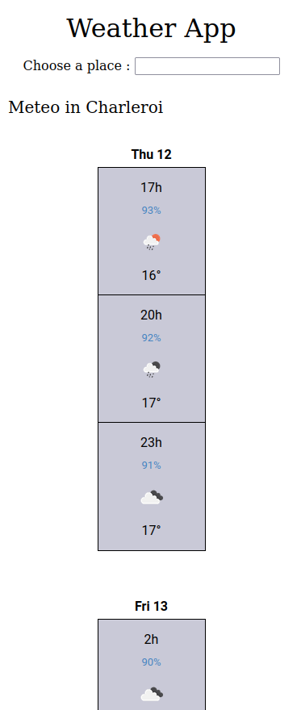
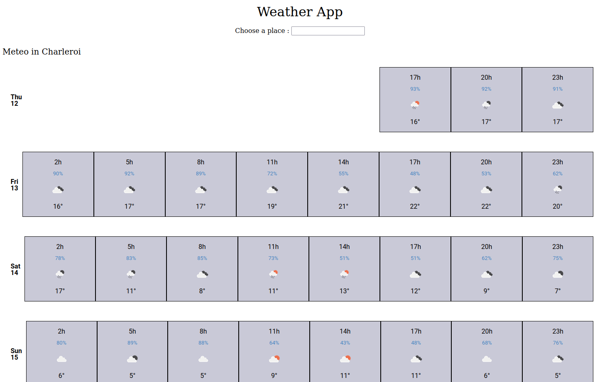

# weather-app
Becode exercise 18 : create a weather app with http flow and dom manipulation

## Briefing
[Instructions](https://github.com/becodeorg/CRL-KELLER-6/tree/main/1.TRAIL/2.The-Hill/1.DOM/13.Weather-app) for the exercise.

## Printscreen

## Used languages
HTML, SASS, JavaScript
Vite

## Authors
Virginie Dourson

## Date
10/2023

## Progression
WIP

## Github page
https://weather-app-gray-omega.vercel.app/

## Note
As I already did this projet with Becode/Keller5, I took time to explore things I hadn't understand/had time to explore before :
- understand bundling, transpiling, linting, formatting and package managers with Javascript 
- create a project with Vite, and get used to it utilisation, and working
- understand environnement variables
- try to secure my API key from exposing it on github (WIP)
- clarify relative paths

